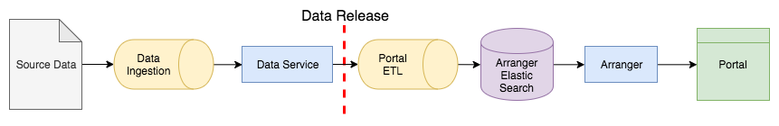

Portal Data Flow
================

To understand how data arrives on the portal, it is necessary to understand the different components that data must flow through.

   
   Data flow from source data to the portal

Source Data
-----------

Data arrives through various methods in various formats.
Delivery methods are often csv, tsv, spreadsheets, or text either sent through email, or placed in internet accessible storage.

Ingestion
---------
Source documents contain data that must be extracted into the Data Service's data model.
Due to the variable nature of the source data, extraction requires manual evaluation by one familiar with the Data Service's model.
Extraction can be performed with the aid of the `Data Ingest Library <https://github.com/kids-first/kf-lib-data-ingest>`_.

Data Service
------------

The Data Service acts as both the data access layer as well as defines the data model for internal representation of the data.
It exposes data via an http REST API.

Data Release
------------

There is a hard limit before data moves on in its lifecycle.
Progressing further in this pipeline from here will result in the data being made public.

Portal ETL
----------

The Portal ETL transforms data within the Data Service to a form that is efficient for filtering by the end user and stores it inside Elastic Search.
The ETL process is highly dependent on the Data Service's data model and can suffer catastrophic failure when the Data Service's data model changes in non-compatible ways.

Arranger
--------

Arranger as a graphQL API that exposes data within Elastic Search to the portal interface.
Arranger is highly dependent on the data model within Elastic Search.
If the shape of Elastic Search indicies change, the Arranger API may cause errors until the data has been re-indexed by the Portal ETL to the correct shape, or Arranger has been configured with the correct shape.

Portal
------

The portal communicates with Arranger to fetch data depending on various filters and search terms that the user has entered.
