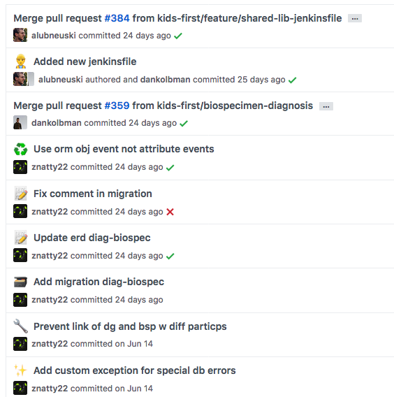

Commit Messages
===============

   Commit history in the Kids First Dataservice repository

Commit messages are vital in being able to navigate a code base's history as well as enable easier and more productive code reviews.
There are many resources providing best practices for commit messages:

 - `Git Commits <https://chris.beams.io/posts/git-commit/>`_
 - `Standard to follow when writing git commit messages <https://stackoverflow.com/questions/15324900/standard-to-follow-when-writing-git-commit-messages>`_
 - `git-scm Commit Guidelines <https://www.git-scm.com/book/en/v2/Distributed-Git-Contributing-to-a-Project#_commit_guidelines>`_

Being proficient at the following git commands will greatly help to keep commits tidy:

 - `git-rebase <https://www.git-scm.com/docs/git-rebase>`_
 - `git-blame <https://www.git-scm.com/docs/git-blame>`_
 - `git-cherry-pick <https://git-scm.com/docs/git-cherry-pick>`_

Here are more detailed how-tos using some of these commands with examples:

 - `Rewriting History <https://git-scm.com/book/en/v2/Git-Tools-Rewriting-History>`_
 - `Interactive Staging <https://git-scm.com/book/en/v2/Git-Tools-Interactive-Staging>`_

We require commits to be prefixed with a single emoji that appropriately summarizes the the gist of the commit.
This is helpful in allowing one to scan through the commit log visually inside of Github or be able to perform summary analysis inside of release notes or when analyzing git activity as a whole.
When adding an emoji to the commit message, use the colon-ated version as opposed to the actual unicode symbol, eg: `:sparkles:`.
For inspiration of what emoji may be most appropriate, see the `gitmoji guide <https://gitmoji.carloscuesta.me>`_.
There is also a `gitmoji cli tool <https://github.com/carloscuesta/gitmoji-cli>`_ to make it easier to author commit messages.
